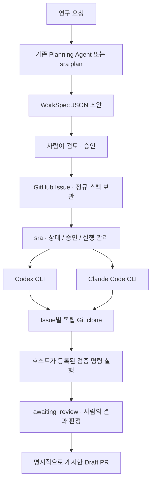

# Symphony Research Agent Orchestrator

**개인 연구 저장소를 위한, 스펙 중심의 로컬 에이전트 실행기입니다.**
연구 코드는 기존 저장소에 두고, 이 저장소에서 설치한 `sra` CLI로 Planning → Spec → Issue → 실행 → 검증 → Draft PR을 관리합니다.

> **상태: v0.1.0 / Alpha.** 신뢰하는 로컬 저장소에서 평가하는 초기 구현입니다.
> OpenAI Symphony의 설계에서 아이디어를 가져온 **독립 Python 구현**이며, OpenAI 공식 제품·Elixir 포크·전체 Symphony SPEC의 호환 구현은 아닙니다.
> 실제 Codex/Claude 인증 실행은 사용자의 머신에서 `doctor --smoke`로 확인해야 합니다. 기본 테스트는 가짜 CLI와 실제 임시 Git 저장소를 사용합니다.

## 무엇이 달라지나요?



한 작업은 **WorkSpec 1개 + Issue 1개 + 작업 공간 1개 + 동시에 실행되는 에이전트 최대 1개**를 갖습니다.
재시도나 제공자 전환은 같은 작업 공간에서 새로운 attempt와 네이티브 세션으로 실행합니다. 하나의 세션을 Codex와 Claude 사이에서 변환하지는 않습니다.

| 연구 저장소가 소유하는 것 | 이 실행기가 소유하는 것 |
|---|---|
| `WORKFLOW.md`, `AGENTS.md`, `CLAUDE.md` | 프로세스 실행·취소·타임아웃 |
| `.agent/POLICY.md`, `.agent/PLANNING.md` | SQLite 승인·실행 상태와 중복 실행 방지 |
| 연구 코드, 테스트, 데이터 참조 | Codex/Claude 어댑터와 이벤트 정규화 |
| PR에 포함되는 `docs/specs/<id>.md` | 독립 작업 공간과 검증 후 Draft PR 게시 |

**복잡한 다중 에이전트 프레임워크나 새 연구 저장소로의 이전은 필요하지 않습니다.** 이미 쓰는 Planning Agent가 WorkSpec JSON을 작성해도 됩니다.

## 시작하기

### 1. 실행기를 독립적으로 설치합니다

Python **3.11 이상**, Git, Linux/macOS가 필요합니다. Windows는 이 릴리스에서 직접 지원하지 않습니다.
사용할 제공자의 CLI는 별도로 설치하고 로그인해 두세요. 둘 다 설치할 필요는 없습니다.

```bash
git clone https://github.com/intMinsu/symphony-research-agent-orch.git
cd symphony-research-agent-orch
python3 -m venv .venv
source .venv/bin/activate
python -m pip install -e '.[dev]'
sra --version
```

연구 저장소에 이 코드를 복사하거나 Git submodule로 넣지 않습니다. 활성화한 가상환경의 `sra`를 외부에서 사용합니다.
재현성이 필요하면 검증한 실행기 커밋과 Python 의존성 버전을 고정하고, 실제 CLI 버전은 실행 기록으로 확인하세요.

### 2. 기존 연구 저장소에 정책 파일을 만듭니다

아래 경로와 `OWNER/REPO`를 **실제 연구 저장소**로 바꿉니다. 오케스트레이터 저장소가 아니라 작업할 연구 저장소입니다.

```bash
RESEARCH=/absolute/path/to/your-research-repo
sra --project "$RESEARCH" init --repository OWNER/REPO
```

생성되는 파일은 다음과 같습니다. 기존 `AGENTS.md`와 `CLAUDE.md`는 덮어쓰지 않습니다.

```text
research-repo/
├── WORKFLOW.md             # 실행 설정 + 공통 작업 절차
├── AGENTS.md               # Codex 등 에이전트용 지침
├── CLAUDE.md               # Claude용 지침
└── .agent/
    ├── POLICY.md           # 공통 연구 정책
    └── PLANNING.md         # 스펙 작성 정책
```

기존 지침 파일을 유지했다면 새 `.agent/POLICY.md`를 참조하도록 직접 확인하세요.
`WORKFLOW.md`의 `base_ref`는 기본적으로 `main`입니다. 실제 기본 브랜치가 다르면 수정합니다.

검증 명령은 연구 환경에 맞게 등록합니다. **초기 템플릿의 검증 명령은 비어 있습니다.**

```yaml
checks:
  unit:
    argv: ["python", "-m", "pytest", "-q"]
    timeout_seconds: 900
required_checks: ["unit"]
```

스펙에는 셸 명령 대신 `unit` 같은 check ID만 들어갑니다. 에이전트가 Issue 본문에 임의의 호스트 명령을 추가할 수 없습니다.
설정·정책 파일을 검토하고 **선택한 base_ref에 포함되도록 커밋**합니다. 실행은 커밋된 코드만 사용하며, 원본 체크아웃이 dirty이면 중단합니다.

```bash
git -C "$RESEARCH" add WORKFLOW.md AGENTS.md CLAUDE.md .agent/POLICY.md .agent/PLANNING.md
git -C "$RESEARCH" commit -m "Configure research agent workflow"
sra --project "$RESEARCH" validate
```

### 3. 인증과 CLI 호환성을 확인합니다

GitHub 작업용 `GITHUB_TOKEN` 또는 `GH_TOKEN`을 **로컬 환경의 비밀 관리 방식**으로 설정합니다.
선택한 연구 저장소의 Contents, Issues, Pull requests 쓰기 권한이 필요합니다. 토큰을 Markdown·스펙·커밋에 넣지 마세요.
모델 인증은 각 CLI의 기존 로그인 또는 제공자 환경변수를 사용합니다.

```bash
# 도움말과 기능 표면만 확인합니다. 모델은 호출하지 않습니다.
sra --project "$RESEARCH" doctor --provider codex --trust-project
sra --project "$RESEARCH" doctor --provider claude --trust-project

# 선택 사항: 실제 모델을 호출합니다. 사용량/과금이 발생할 수 있습니다.
sra --project "$RESEARCH" doctor --provider codex --smoke --trust-project
```

`--trust-project`는 저장소 코드·설정·검증 명령을 신뢰한다는 명시적 확인입니다. **보안 샌드박스를 생성하는 옵션은 아닙니다.**

### 4. 스펙을 만들고 승인합니다

기존 Planning Agent의 JSON을 바로 사용할 수 있습니다. 또는 내장된 단발성 Planning CLI를 실행합니다.
초안은 원본 연구 체크아웃을 dirty하게 만들지 않도록 외부 디렉터리에 둡니다.

```bash
DRAFTS="$HOME/.local/share/sra-drafts"
mkdir -p "$DRAFTS"

sra --project "$RESEARCH" plan \
  --id EXP-001 \
  --provider claude --model opus --effort high \
  --request "Add one reproducible ablation with a fixed seed and explicit evidence." \
  --output "$DRAFTS/EXP-001.json" \
  --trust-project

sra spec validate "$DRAFTS/EXP-001.json"
sra spec render "$DRAFTS/EXP-001.json"

# 검토를 끝낸 뒤 실행합니다: Issue 게시 + 라벨 + 로컬 승인
sra --project "$RESEARCH" publish "$DRAFTS/EXP-001.json" --ready
```

모델 ID·effort는 예시이며 **설치된 CLI와 계정에서 실제 지원하는 값**을 사용합니다. 두 제공자의 effort가 같은 계산량을 의미한다고 가정하지 않습니다.
`model`과 `effort`를 생략하면 설정값 또는 CLI 기본값을 사용합니다. `plan`은 자동으로 Issue를 만들거나 실행하지 않습니다.

이미 다른 곳에서 만든 Issue를 승인할 때는 다음 절차를 사용합니다.

```bash
sra --project "$RESEARCH" inspect 123
sra --project "$RESEARCH" approve 123 --spec-sha <INSPECT에_표시된_SHA256>
```

Issue에 `agent-ready` 라벨만 붙이는 것으로는 실행되지 않습니다. **로컬 승인과 현재 스펙·정책 해시가 모두 일치해야 합니다.**

### 5. 실행하고 결과를 게시합니다

`123`은 앞에서 만들어진 **연구 저장소의 Issue 번호**로 바꿉니다.

```bash
sra --project "$RESEARCH" run 123 --provider codex --trust-project
sra --project "$RESEARCH" status

# 결과를 확인한 뒤 명시적으로 커밋·푸시·Draft PR 생성
sra --project "$RESEARCH" deliver 123 --trust-project
```

`run ... --publish-pr`로 검증 후 Draft PR까지 이어서 게시할 수도 있습니다. 기본 `run`은 푸시하지 않습니다.
자동 검증을 통과한 상태는 `awaiting_review`입니다. **에이전트의 완료 메시지나 테스트 성공만으로 연구 가설이 입증되었다고 판정하지 않습니다.**
PR 병합, Issue 종료, 과학적 결과의 수용 여부는 사람이 결정합니다.

## Codex와 Claude를 바꿔 쓰기

```bash
# 같은 Issue·branch·workspace에서 새 attempt를 시작합니다.
sra --project "$RESEARCH" run 123 \
  --provider claude --effort high --retry \
  --feedback-file /absolute/path/to/review-feedback.md \
  --trust-project
```

같은 제공자의 재시도도 `--retry`가 필요합니다. 각 attempt는 새 네이티브 세션이며, 이전 결과 요약과 현재 파일 상태를 인계합니다.
기존 Codex 세션을 Claude로 resume하거나 세션 기록 형식을 변환하지 않습니다.
스펙 내용을 바꾸면 `revision`을 올리고 다시 게시·승인해야 합니다.

| 원칙 | 실제 동작 |
|---|---|
| 버전 문자열만으로 거부하지 않기 | 버전은 기록용으로만 사용합니다. |
| 필요한 기능을 확인하기 | 도움말의 필수 플래그를 확인하고, 실행 시 종료 이벤트도 검증합니다. |
| 선택적 새 이벤트 수용 | 알 수 없는 이벤트는 진단 이벤트로 남깁니다. |
| 보안 옵션은 조용히 낮추지 않기 | 필수 권한·샌드박스 플래그가 없으면 실행을 중단합니다. |
| 실제 호환성은 별도 검증 | `doctor --smoke`는 실제 인증·모델 호출을 확인하지만 모든 동작의 인증서는 아닙니다. |

Codex는 `codex exec --json`, Claude는 `claude --print --output-format stream-json`을 사용합니다.
이 릴리스는 Codex App Server나 SDK의 세션 프로토콜에 직접 결합하지 않습니다. 그래도 **모든 과거·미래 CLI 버전과의 호환을 보장하지는 않습니다.**

## 여러 작업과 운영

```bash
# 로컬에서 승인한 작업만 가져옵니다. 기본 동시 실행 수는 1입니다.
sra --project "$RESEARCH" watch --trust-project

# 한 번에 동시 실행 한도만큼만 처리한 뒤 종료
sra --project "$RESEARCH" watch --once --trust-project

sra --project "$RESEARCH" status --json
sra --project "$RESEARCH" logs <RUN_ID>
sra --project "$RESEARCH" cancel <RUN_ID>

# 실제 프로세스가 종료된 것을 확인한 뒤에만 실행
sra --project "$RESEARCH" recover <RUN_ID> --confirm-stopped
```

동시 실행 수는 `limits.max_concurrent_runs`로 조절합니다. `watch`는 실패한 연구 작업을 자동 재시도하지 않습니다.
GitHub 조회에는 제한된 재시도가 있지만, 비용이 큰 실험의 반복은 사람이 `--retry`로 결정합니다.

tmux는 필요하면 `sra watch` 프로세스를 감싸는 용도로 사용합니다. 화면 문자열을 파싱하거나 `send-keys`로 완료를 추측하지 않습니다.

기본 런타임 상태는 `${XDG_STATE_HOME:-~/.local/state}/sra`에 저장됩니다. Git에 커밋하지 않습니다.

```text
sra/
├── state.sqlite3                 # 승인, 실행 상태, 로컬 실행 소유권
├── workspaces/<repo-hash>/<issue>/ # 서로 Git 메타데이터를 공유하지 않는 clone
├── runs/<run-id>/                 # 스펙 snapshot, 이벤트, 결과, 검증 로그
└── planning/<plan-id>/            # Planning 이벤트 및 후보 결과
```

`git worktree` 대신 독립 clone을 선택해 Git 메타데이터 공유를 피했습니다. 그만큼 디스크·환경 준비 비용은 더 듭니다.
대용량 데이터·GPU 할당·컨테이너 구성·의존성 부트스트랩은 현재 자동 관리하지 않습니다.

## 구현 범위와 한계

**구현됨:** 독립 설치 CLI, 스키마 검증, Planning 초안 생성, Issue 게시·승인, 제공자 선택, 로컬 실행 기록, 중복 실행 방지, 프로세스 그룹 종료, 타임아웃, 범위 검사, 등록된 검증 명령, 명시적 재시도, Draft PR 게시, 제한된 동시 실행.

**아직 지원하지 않음:** 네이티브 세션 resume, 자동 PR 리뷰 수집/반영 루프, 자동 병합, 분산 실행/다중 호스트 소유권, GPU 스케줄링, 강제 OS 격리, 웹 대시보드, API 전용 Planning 백엔드, 자동 workspace 정리/리베이스.

특히 Claude의 `dontAsk` + 도구 허용 설정은 Codex의 파일시스템 샌드박스와 동등하지 않습니다.
**작업 공간 분리, 토큰 환경변수 제거, 경로 검사는 적대적인 코드를 안전하게 실행하는 보안 경계가 아닙니다.** [보안 문서](SECURITY.md)를 먼저 읽어주세요.

## 개발과 문서

```bash
python -m pytest -q
sra schema all --output-dir schemas --check
python -m compileall -q src
```

스키마를 수정했다면 `sra schema all --output-dir schemas`로 생성 파일을 갱신합니다.
런타임 모델과 JSON Schema가 서로 다른 규칙을 갖지 않도록 동일한 Pydantic 모델에서 생성합니다.

| 문서 | 내용 |
|---|---|
| [Architecture](docs/architecture.md) | 구성요소·상태 전이·책임 경계 |
| [Contracts and schemas](docs/contracts.md) | Workflow / WorkSpec / Event / Run 스키마 |
| [Operations](docs/operations.md) | CLI, 재시도·복구·문제 해결 |
| [Compatibility](docs/compatibility.md) | CLI 기능 검사와 실제 호환성의 한계 |
| [Security](SECURITY.md) | 신뢰 경계와 토큰·로컬 코드 주의사항 |
| [Validation](docs/validation.md) | 실행한 테스트와 검증하지 못한 항목 |
| [Examples](examples/) | 실행 설정과 WorkSpec 예시 |

프로젝트는 연구용 실행 인프라를 연구 코드에서 분리하는 데 초점을 둡니다. 새로운 범용 agent framework를 만드는 것이 목표는 아닙니다.
