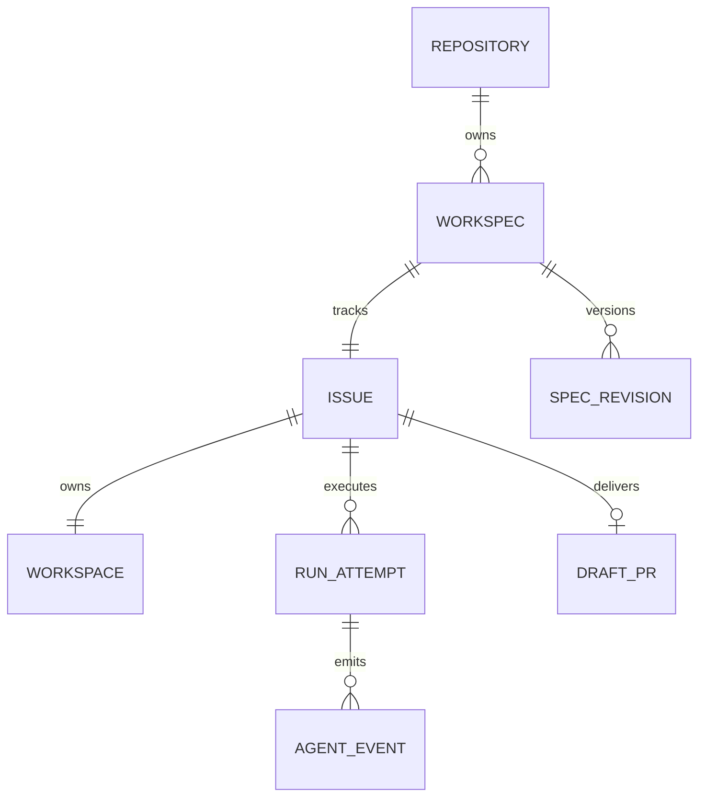
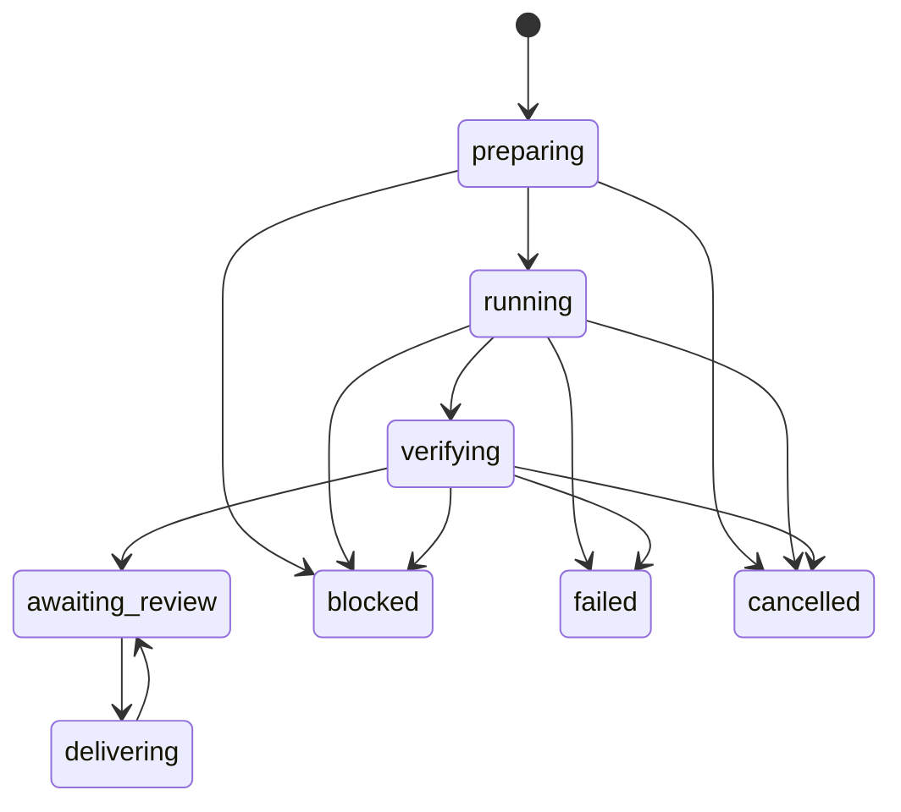

# Architecture

## Status and intent

SRA 0.1.0 is a local-first alpha implementation inspired by the documented Symphony coordination model. It is not the upstream Elixir implementation, a drop-in fork, or a claim of conformance to every Symphony requirement. The runtime is Python 3.11+, SQLite, Git, and provider CLIs. Pydantic and PyYAML are the two runtime package dependencies.

The boundary is deliberate: a research repository owns scientific intent and policy; this independently installed package owns coordination. An existing main planner can produce a WorkSpec without using the built-in planner.

## Components

| Module | Responsibility | Does not own |
|---|---|---|
| `models.py` | Versioned contracts and schema definitions | Provider model catalog |
| `config.py` | Trusted project policy, YAML parsing, policy digest | Remote Issue commands |
| `specs.py` | Canonical Issue JSON and Markdown projection | Approval decisions |
| `store.py` | Local approvals, atomic run claims, transitions | A distributed lease service |
| `runners.py` | Codex/Claude argv, capability evidence, normalized events | GitHub lifecycle |
| `process.py` | Bounded streams, timeout, process-group cancellation | An OS sandbox |
| `workspace.py` | Independent clones, fixed base SHA, change checks, host delivery | Dataset/GPU provisioning |
| `github.py` | Repository-scoped REST, Issues, workpad, draft PRs | Agent reasoning |
| `engine.py` | Planning/dispatch/verification/delivery coordination | Scientific acceptance |
| `cli.py` | Explicit operator commands | An autonomous supervisor agent |

## Identity and cardinality

These are logical relationships, not all SQL tables. Approval uniqueness is `(repository, issue_number)` and `(repository, spec_id)`. A partial unique SQLite index permits at most one active run for an Issue in a shared local state directory. Publication is serialized by a local file lock.

A workspace has one deterministic branch, `sra/issue-<number>`. Runs have opaque UUIDs. Retry preserves the workspace and branch but creates a new run and a new provider-native session. The native session ID is diagnostic metadata; it is not the workflow identity.

Separate state directories, different hosts, or manual native CLI processes are outside this coordination boundary. Do not run two uncoordinated controllers against the same Issues.

## Data flow

1. A planner reads a committed repository snapshot and produces WorkSpec JSON.
2. A person inspects the contract. `publish --ready` creates/updates the Issue, labels it, and records local approval of the spec and project policy digests.
3. `run` or `watch` reads the Issue and requires native eligibility plus an exact local approval match.
4. The store atomically claims a run. The runner checks CLI surfaces before execution.
5. A separate local Git clone is prepared at the recorded base commit. Policy files must match the local trusted policy. The original checkout remains unchanged.
6. The host writes the canonical Markdown spec into the clone and starts one agent process.
7. The adapter emits normalized events. The host retains logs and native session metadata.
8. The host checks changed paths, runs configured check IDs, and fingerprints the resulting content.
9. A successful run becomes `awaiting_review`, not scientifically accepted or merged.
10. Explicit delivery commits verified content, pushes an immutable commit SHA, and creates or reuses a draft PR. The Issue stays open.

## State machine

Active states are `preparing`, `running`, `verifying`, and `delivering`. Failed/blocked/cancelled attempts remain immutable historical attempts except for diagnostic metadata. Rework creates another run. A delivery network error returns the same run to `awaiting_review` with a recorded error so publication can be retried without running the model again.

Transition validation, atomic claims, and a compare-and-set on delivery prevent two local callers from owning the same active workflow. Expiration alone never steals ownership. Orphan recovery is explicit and checks the recorded host, PIDs, and child process group.

## Why native non-interactive CLIs

This release uses Codex `exec --json` and Claude Code print/stream-json. It does not implement the Codex App Server protocol and does not make the orchestration core parse its JSON-RPC methods. This is a smaller contract for the first release, at the cost of fresh sessions for every attempt and no interactive approvals from the supervisor.

Only adapters consume provider output. Unknown optional events remain diagnostic records. A zero exit code without a recognized successful terminal event is not success. Version strings are logged, not compared against an allowlist. See [compatibility.md](compatibility.md).

## Planner versus coordinator

The built-in planner is one CLI invocation with restricted/read-only intent and a validated JSON result. It is not a fleet-wide reasoning loop. It never publishes or dispatches its own draft.

A more sophisticated existing planner can own decomposition, research reasoning, model selection, and spec revision. Its interface is the WorkSpec schema plus explicit `publish`/`approve` commands. The coordinator must not delegate run ownership, retries, approval, or merge authorization to an LLM.

## Research-specific choices

- Negative and inconclusive results are legitimate. Acceptance requires evidence, not a desired answer.
- `delivery: report` permits a local research outcome without forcing a PR.
- Dataset identifiers, seeds, metrics, and artifact references are spec metadata. They do not provision infrastructure.
- Automatic experiment retry is disabled. The operator explicitly chooses `--retry`.
- Workspaces and logs are retained. Closing an Issue does not delete unpublished research artifacts.
- No automatic merge, baseline rewriting, training daemon, or GPU allocation is implemented.

## Deployment boundary

One local host and one shared private state root are the supported topology. `sra watch` is a foreground process and may be run in tmux or a service manager. tmux is not the transport or database.

Independent clones use more disk than worktrees, but do not share mutable Git metadata. They are still not security sandboxes. An agent or test running trusted local shell commands may reach data outside its clone unless the operator supplies additional isolation.
